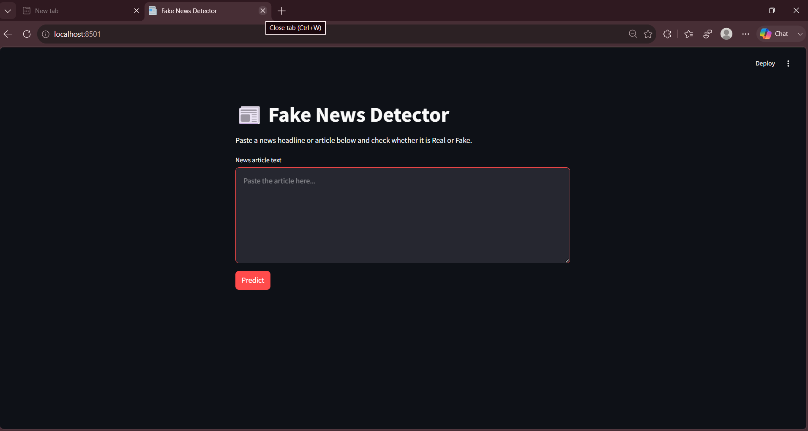
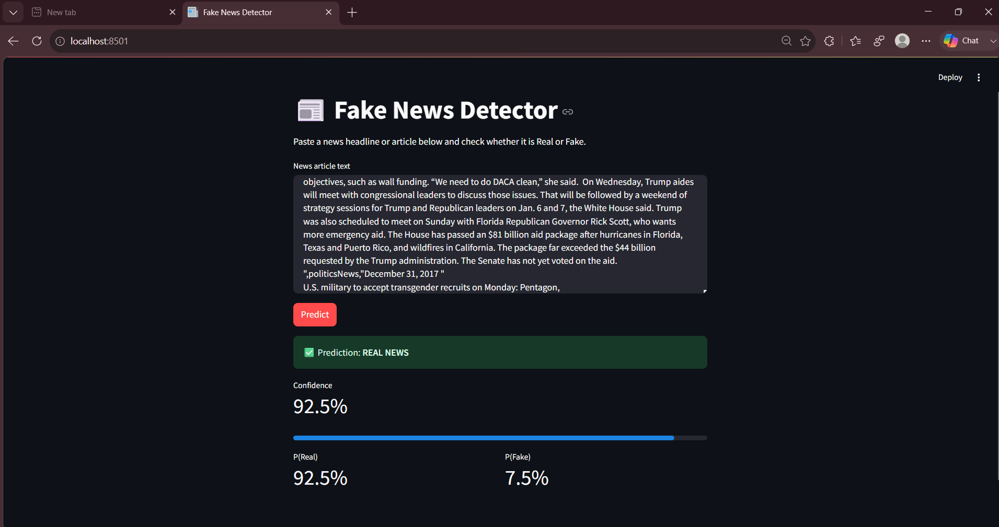
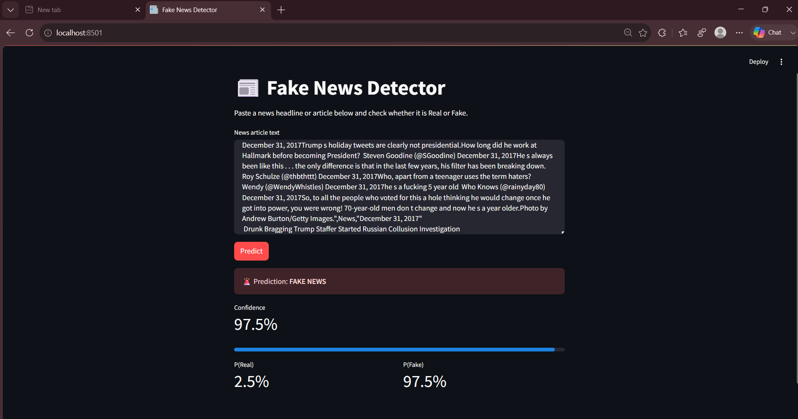

# 📰 Fake News Detection System

A Machine Learning-based web application that classifies news articles as **Real** or **Fake** using **Natural Language Processing (NLP)** and **TF-IDF Vectorization**. Built with **Python**, **Scikit-learn**, and **Streamlit**.

---

## 🚀 Features

- Detects Fake and Real news articles
- Text preprocessing using NLTK
- TF-IDF Vectorization
- Confidence & probability scores
- Interactive Streamlit interface
- Compares multiple ML models

---

## 🛠️ Tech Stack

- Python
- Pandas
- NumPy
- Scikit-learn
- NLTK
- Joblib
- Streamlit

---

## 🤖 Models Compared

| Model | Accuracy |
|--------|---------:|
| Logistic Regression | 98.89% |
| Passive Aggressive Classifier | 99.51% |
| Multinomial Naive Bayes | 94.48% |
| **Random Forest (Best)** | **99.75%** |

---

## 📂 Project Structure

```text
Fake-News-Detection/
│
├── app.py
├── train_model.py
├── requirements.txt
├── dataset/
├── models/
└── src/
```

---

## ⚙️ Installation

```bash
git clone https://github.com/sxmarthh/Fake-News-Detection-System.git

cd Fake-News-Detection-System

pip install -r requirements.txt
```

---

## ▶️ Run

```bash
streamlit run app.py
```

To retrain the model:

```bash
python train_model.py
```

---

## 📸 Screenshots

### Home Page



---

### Real News Prediction



---

### Fake News Prediction



---

## 📈 Dataset

- **Source:** Kaggle – Fake and Real News Dataset
- **Articles:** 44,898

---

## 🔮 Future Improvements

- Live News API
- BERT/LSTM Models
- Multi-language Support
- URL-based Detection
- Source Verification

---

## 👨‍💻 Author

**Tanishq Rastogi**
